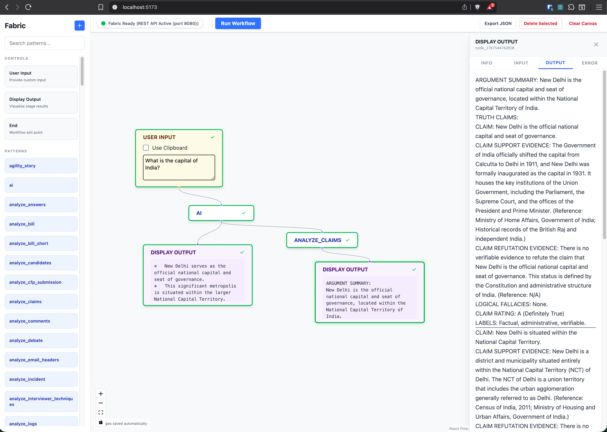

# Fabric Workflow Builder

A visual, drag-and-drop interface for building and executing AI workflows using [Fabric](https://github.com/danielmiessler/Fabric).

## Overview



This application allows you to chain together Fabric patterns to create complex AI pipelines. It provides a visual canvas to arrange nodes, manages data flow between them, and executes the patterns using your local Fabric installation.

## Prerequisites

Before running this project, ensure you have the following installed:

1.  **Node.js** (v18 or higher)
2.  **Fabric** (Latest version)
    *   **Installation:** Follow the instructions at the [Fabric Repository](https://github.com/danielmiessler/Fabric).
    *   **Configuration:** Ensure you have run `fabric --setup` and configured your API keys (e.g., OpenAI, Anthropic).
    *   **Verification:** Run `fabric --version` in your terminal to verify installation.

## Setup & Installation

1.  **Clone the repository:**
    ```bash
    git clone https://github.com/asasidh/fabric-workflow-builder.git
    cd fabric-workflow-builder
    ```

2.  **Install dependencies:**
    *   **Client (Frontend):**
        ```bash
        cd client
        npm install
        cd ..
        ```
    *   **Server (Backend):**
        ```bash
        cd server
        npm install
        cd ..
        ```

## Running the Application

To fully utilize the application, you need to run three separate processes (in separate terminals).

### 1. Start the Fabric API Server
This application communicates with Fabric primarily via its REST API.

```bash
fabric --serve
```
*Note: This typically runs on `http://localhost:8080`.*

### 2. Start the Backend Server
The backend bridges the frontend with the Fabric API and handles execution logic.

```bash
cd server
npm run dev
```
*Note: The server runs on `http://localhost:3001`.*

### 3. Start the Frontend Client
The visual interface for building workflows.

```bash
cd client
npm run dev
```
*Note: The client typically runs on `http://localhost:5173`.*

## Usage

1.  Open your browser to `http://localhost:5173`.
2.  **Status Check:** Look at the top-right corner. You should see a **Green Dot** indicating "Fabric Ready". If it's Red, ensure `fabric --serve` is running.
3.  **Pattern Library:** The left sidebar contains all your Fabric patterns. You can **Search** for specific patterns or **Create** new ones directly from the interface.
4.  **Building a Workflow:**
    *   Drag **User Input** node to the canvas.
    *   Drag a **Pattern** (e.g., `summarize`) to the canvas.
    *   Drag an **End** node to the canvas.
    *   **Connect** them: Output handle -> Input handle. The connection line will indicate the data flow.
5.  **Execution & Monitoring:**
    *   Click the **"Run Workflow"** button in the top-right toolbar.
    *   Enter your input text in the User Input node.
    *   Watch nodes update their status (Running -> Success/Error).
    *   **Node Details:** Click on any node to open the right sidebar, where you can view its configuration, status, and raw output/result.

## Features

- **Visual Workflow Canvas:** Drag-and-drop nodes to build complex AI pipelines.
- **Pattern Management:** Search through existing Fabric patterns and create new ones.
- **Real-time Status:** Live indicators for Fabric connectivity and node execution state.
- **Detailed Execution Logs:** View the full input/output for every step in your workflow.
- **Flexible Execution:** Connects directly to the Fabric REST API with CLI fallback.

## Project Status

The following core modules have been implemented:
- [x] **UI Refinement:** Professional node styling and status indicators.
- [x] **Pattern Management:** Search, library organization, and pattern creation.
- [x] **Data Flow:** Robust chaining of multiple patterns with visual transparency.
- [x] **Execution Engine:** Seamless integration with `fabric --serve`.

## Troubleshooting

*   **"Fabric Not Found" (Red Dot):**
    *   Ensure `fabric --serve` is running.
    *   If using CLI fallback mode, ensure `fabric` is in your system PATH or accessible at `~/go/bin/fabric`.
*   **No Patterns in Sidebar:**
    *   Check if `fabric --list` returns patterns in your terminal.
    *   Restart the backend server if you recently installed new patterns.

## Architecture

*   **Frontend:** React, React Flow, Tailwind CSS, Framer Motion.
*   **Backend:** Node.js, Express, TypeScript.
*   **Integration:** Connects to Fabric via HTTP (`localhost:8080`) or CLI spawn fallback.
